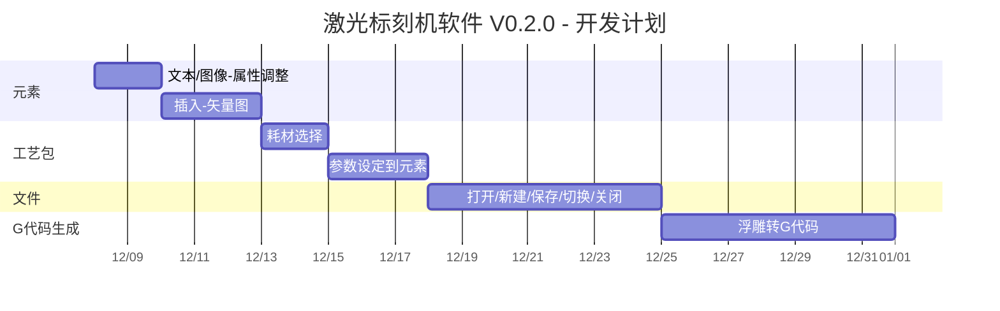

# 激光标刻机

# 2. 工作计划

| 目标          | 任务                        | 问题                      | 备注                                                         |
| ------------- | --------------------------- | ------------------------- | ------------------------------------------------------------ |
| 调研          | 原型设计                    | 需求分析                  |                                                              |
|               |                             | 用户交互                  |                                                              |
|               |                             |                           |                                                              |
|               | 技术选型                    | 编程语言                  |                                                              |
|               |                             | 难点分析                  |                                                              |
|               |                             |                           |                                                              |
| 标刻软件0.1.0 | 主视图-元素                 | 移动-文字                 |                                                              |
|               |                             | 移动-位图                 |                                                              |
|               |                             |                           |                                                              |
|               | 左侧面板-元素               | 插入-文字                 |                                                              |
|               |                             | 插入-位图                 |                                                              |
|               |                             |                           |                                                              |
|               | 顶部面板-元素               | 位置                      |                                                              |
|               |                             | 大小                      |                                                              |
|               |                             | 角度                      |                                                              |
|               |                             |                           |                                                              |
|               |                             | 文字-字体                 |                                                              |
|               |                             | 文字-风格                 |                                                              |
|               |                             |                           |                                                              |
|               |                             | 删除-位图                 |                                                              |
|               |                             | 删除-文字                 |                                                              |
|               |                             |                           |                                                              |
|               |                             | 旋转-文字                 |                                                              |
|               |                             | 旋转-位图                 |                                                              |
|               |                             |                           |                                                              |
|               |                             | 缩放-位图                 |                                                              |
|               |                             | 缩放-文字                 |                                                              |
|               |                             |                           |                                                              |
|               | 右侧面板-雕刻机             | 连接状态                  |                                                              |
|               |                             | 走边框                    |                                                              |
|               |                             | 加工-文字                 |                                                              |
|               |                             | 加工-位图                 |                                                              |
|               |                             |                           |                                                              |
|               | 设备管理                    | USB-扫描设备              |                                                              |
|               |                             | USB-连接设备              |                                                              |
|               |                             | USB-切换设备              |                                                              |
|               |                             | USB-添加设备              |                                                              |
|               |                             |                           |                                                              |
|               | G代码生成                   | 位图转G代码               | 将图像灰度值映射为激光功率/速度                              |
|               |                             | 矢量图转G代码             | 生成基础指令和圆弧指令                                       |
|               |                             | 文字转G代码               | 生成基础指令和圆弧指令                                       |
|               | --------------------------- | ------------------------- |                                                              |
| 标刻软件0.2.0 | 文件                        | 打开                      | 读取一份结构化数据，里面包含了图元信息。                     |
|               |                             | 切换                      | 在多个文档之间进行切换                                       |
|               |                             | 新建                      | 可以创建多个文档                                             |
|               |                             | 保存                      | 保存一份结构化数据，将编辑的图元信息保存起来。               |
|               |                             | 关闭                      | 清空当前编辑的图元信息。                                     |
|               |                             |                           |                                                              |
|               | 顶部面板-元素               | 复制/粘贴                 |                                                              |
|               |                             | 撤销/恢复                 |                                                              |
|               |                             |                           |                                                              |
|               | 左侧面板-元素               | 插入-矢量图               |                                                              |
|               |                             |                           |                                                              |
|               | 顶部面板-元素               | 文本                      | 可以调整字体类型、字体、对齐方式、文字方向、样式、字间距、行间距，输入想要标刻的文本内容 |
|               |                             | 图像                      | 支持图片PS功能，优化图片样式                                 |
|               |                             |                           |                                                              |
|               |                             |                           |                                                              |
|               | 相机标定                    | 畸变矫正                  |                                                              |
|               |                             | 内参标定                  |                                                              |
|               |                             | 外参标定                  |                                                              |
|               | 激光标定                    | 畸变矫正                  |                                                              |
|               |                             |                           |                                                              |
|               | 工艺包                      | 交互界面                  | 搜索材料                                                     |
|               |                             | 耗材选择                  | 未知材料，椴木板， 椴木胶合板，黑胡桃胶合板，松木胶合板，白蜡胶合板，卡丝楠胶合板，樱桃胶合板 黑色金属名片，蓝色金属名片，紫色金属名片 不锈钢， 黄金， 白银， 铝合金， 原色黄铜， 黑色亚克力， 板岩， 橡胶垫， 皮革 |
|               |                             | 参数设定到元素            | 速度，功率，模式                                             |
|               |                             |                           |                                                              |
|               | G代码生成                   | 浮雕转G代码               | 灰度图映射深度图 深度切片 分层打印 3D预览     |
|               |                             |                           |                                                              |
|               | 右侧面板-雕刻机             | 对焦                      |                                                              |

